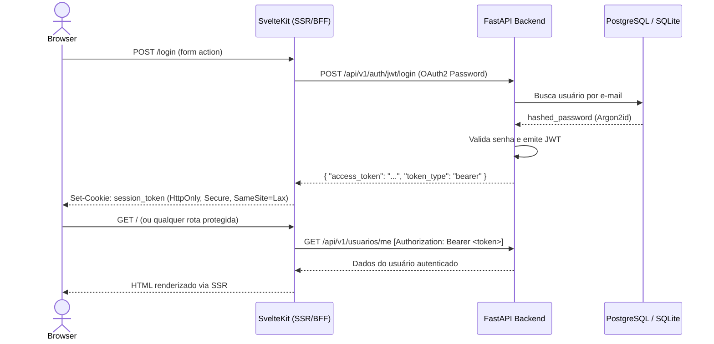

# Arquitetura

O SvelteKit funciona como **BFF (Backend-For-Frontend)**: o navegador conversa exclusivamente com o SvelteKit, e o SvelteKit faz requisições *server-to-server* autenticadas para o **FastAPI Backend**.

---

## Estrutura do Projeto

```text
backend/
├── src/
│   ├── backend/
│   │   ├── domains/
│   │   │   └── usuarios/        # Modelos ORM, schemas Pydantic, manager e rotas
│   │   ├── infra/               # Rate limiter (SlowAPI), HMAC e senhas (Argon2)
│   │   ├── config.py            # Pydantic Settings e validações de produção
│   │   ├── database.py          # SQLAlchemy 2.0 async engine & sessions
│   │   ├── error.py             # AppExceptions e handlers seguros
│   │   └── main.py              # Entrypoint FastAPI, CORS, Lifespan e routers
│   └── main.py
├── tests/                       # Suíte de testes Pytest (98% de cobertura)
├── Dockerfile                   # Build multi-stage enxuto com uv
└── pyproject.toml               # Dependências Python

frontend/
├── src/
│   ├── lib/server/backend.ts    # Helper backendFetch com Bearer token
│   ├── routes/                  # Páginas, form actions e endpoints de proxy
│   ├── hooks.server.ts          # Validação de sessão SSR e headers OWASP
│   └── app.d.ts                 # Tipagem de locals.user e locals.token
├── Dockerfile
└── package.json
```

---

## Fluxo de Autenticação



---

## Principais Endpoints da API

```text
POST   /api/v1/auth/jwt/login           # Login OAuth2 gerando JWT
POST   /api/v1/auth/jwt/logout          # Revogação de token
POST   /api/v1/auth/register            # Cadastro de novo usuário
POST   /api/v1/auth/forgot-password     # Solicitação de recuperação de senha
POST   /api/v1/auth/reset-password      # Redefinição de senha com token
GET    /api/v1/usuarios/me              # Perfil do usuário atual autenticado
PATCH  /api/v1/usuarios/me              # Atualização de perfil
GET    /health                          # Endpoint de verificação de integridade
```
