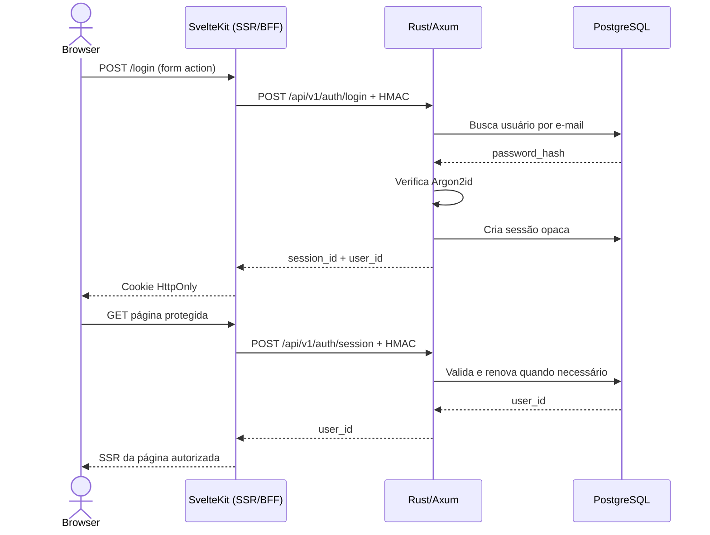

# Arquitetura

O SvelteKit funciona como BFF: o navegador conversa com o SvelteKit, e o SvelteKit chama o Resource Server Rust exclusivamente no lado servidor.

## Estrutura

```text
backend/
├── migrations/          # Schema versionado do PostgreSQL
└── src/
    ├── domains/         # Features: auth e usuarios
    ├── infra/           # HMAC, senha e infraestrutura compartilhada
    ├── error.rs         # AppError e respostas seguras
    └── main.rs          # Pool, migrations, middleware e servidor

frontend/
└── src/
    ├── lib/server/      # Cliente Rust exclusivamente server-side
    ├── routes/          # Páginas, actions e proxies
    ├── hooks.server.ts  # Sessão e proteção de rotas
    └── app.d.ts         # Tipagem de locals.userId
```

## Fluxo de autenticação



## Rotas atuais

```text
POST   /api/v1/auth/login
POST   /api/v1/auth/session
DELETE /api/v1/auth/logout
POST   /api/v1/usuarios
GET    /api/v1/usuarios/{id}
```

O SvelteKit fornece `/login`, `/cadastro`, `/logout` e proxies server-side para o backend.
